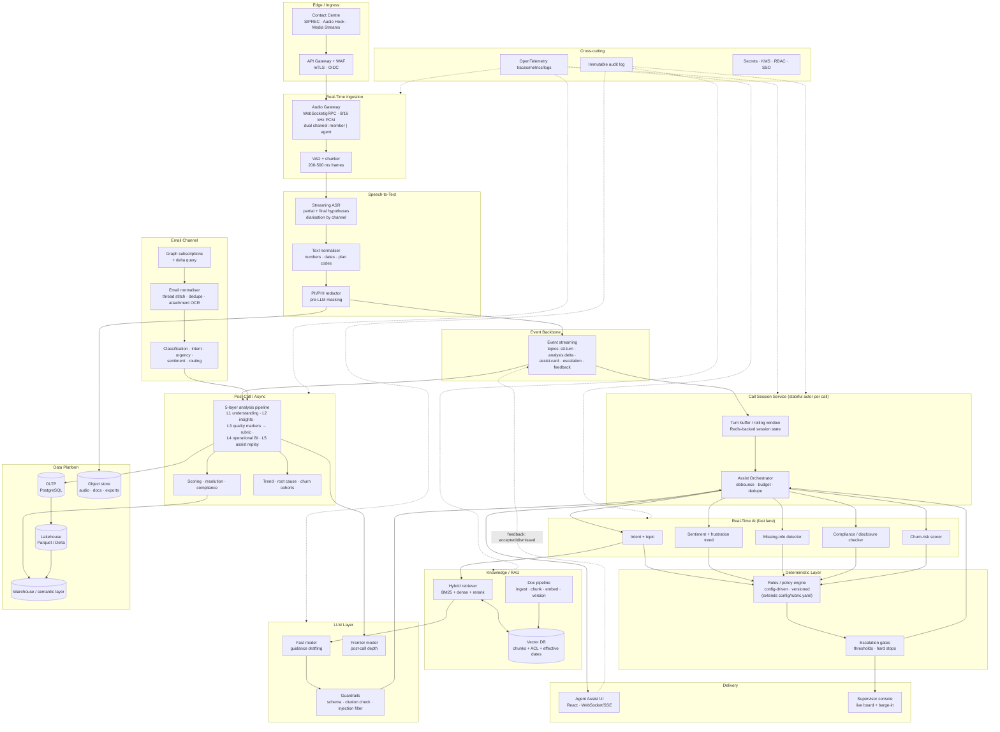

# Real-Time Agent Assist & Call/Email Analytics — Production Technical Architecture

**Document status:** Draft for architecture review
**Date:** 2026-08-31
**Scope:** Member call centre (voice) + Outlook email channel
**Baseline:** NanoVox V2 POC (`Code/Backend`, `Code/Frontend`) — this document extends it, it does not replace it
**Author:** Chief Architect

---

## 0. Executive summary

The POC already proves the hard part of the analytics problem: an LLM pipeline that turns a
member call transcript into a classified, **deterministically scored**, evidence-anchored
analysis, and aggregates those analyses into operational dashboards. What it does not yet
do is operate **during** the call.

This architecture adds three things to that baseline and nothing more radical:

| # | Addition | Why it is additive, not a rewrite |
|---|----------|-----------------------------------|
| 1 | **Streaming spine** — audio ingestion, real-time STT, an event bus, and a stateful per-call session actor | The existing pipeline is request/response over a *complete* transcript. Live assist needs the same analysis over a *growing* transcript. The transcript is the seam. |
| 2 | **Knowledge/RAG layer** with source-of-truth governance | The POC's L1–L3 layers judge the agent against a rubric. Judging whether the agent's answer was *consistent with approved policy* requires plan, billing-rule and procedure documents, retrievable with citations. That corpus is the source of truth for every agent-facing factual assertion, which is why §8 spends as much space on governance as on retrieval. |
| 3 | **Email channel** as a second producer into the same analysis and storage model | An email thread is a transcript with different turn metadata. It reuses L1/L2/L4 almost verbatim. |

The recommended target (Section 12) is the **hybrid**: cloud-managed infrastructure,
managed streaming STT, a **self-hosted small model on GPU for the sub-second real-time
layers**, and a **managed frontier model for post-call depth**. Real-time correctness
gating stays deterministic — rules and rubric, not model opinion — exactly as the POC
already does for scoring.

**Load reality check.** Several thousand calls/month and 7,000 emails/month is a *small*
workload. At 3,000 calls/month over a 21-day, 9-hour working month that is ~16 calls/hour;
with a 9-minute average handle time, roughly **2–4 concurrent calls**, peaking perhaps
8–12 during open enrolment. This matters enormously: the design must be *architected* for
horizontal scale but **must not be sized** for it. A single GPU node carries the entire
real-time load. Over-provisioning is the most likely way this project wastes money.

---

## 1. High-Level Architecture

### 1.1 System context

> **High-level view for stakeholders and slides:**
> [`10-high-level-diagram.svg`](10-high-level-diagram.svg) — sources on the left, the
> **privacy boundary** nothing crosses unredacted, then the two lanes (during the call,
> after the call) over a **shared AI foundation**, with post-call findings feeding live
> guidance. Regenerate with `python scripts/make_highlevel_diagram.py`.

```text
┌────────────┐        PSTN / SIP         ┌───────────────────────────┐
│   MEMBER   │◄────────voice────────────►│  CONTACT CENTRE PLATFORM  │
└────────────┘                           │  (Genesys / Amazon Connect│
                                         │   / Five9 / Teams CC)     │
┌────────────┐   softphone + browser     │  ─ SIPREC / Audio Hook ─  │
│   AGENT    │◄─────────────────────────►│  ─ Event webhooks ──────  │
└─────┬──────┘                           └────────────┬──────────────┘
      │                                               │
      │  WebSocket (assist cards)                     │ dual-channel audio
      │                                               │ + CTI metadata events
      ▼                                               ▼
┌───────────────────────────────────────────────────────────────────────────────┐
│                      NANOVOX REAL-TIME ASSIST PLATFORM                        │
└───────────────────────────────────────────────────────────────────────────────┘
      ▲                    ▲                               ▲
┌─────┴──────┐   ┌─────────┴──────────┐        ┌───────────┴────────┐
│ SUPERVISOR │   │ KNOWLEDGE SOURCES  │        │  M365 / OUTLOOK    │
│  console   │   │ SharePoint · KB ·  │        │   (Graph API)      │
│            │   │ approved documents │        │                    │
└────────────┘   └────────────────────┘        └────────────────────┘
```

### 1.2 Component architecture (real-time voice path)

> **Presentation-quality version:** [`10-architecture-diagram.svg`](10-architecture-diagram.svg)
> — the same architecture as the Mermaid source below, laid out for slides and print,
> with the §6.1 latency budget annotated per stage and the PHI boundary marked. Regenerate
> it with `python scripts/make_architecture_diagram.py` (run from the repo root) if this
> section changes — the script asserts that every label fits its box.



### 1.3 Where the current POC sits inside this

| POC component | Role in target architecture | Change required |
|---|---|---|
| `domain/parsing.py`, `entities/transcript.py`, `entities/turn.py` | Canonical transcript model for **both** channels | Add `partial: bool`, `t_offset_ms`, `channel` to `Turn`; add an append-only `LiveTranscript` |
| `use_cases/analyze_transcript.py` (L1→L5) | **Post-call** pipeline, unchanged in intent | Split into per-layer use cases so the live lane can call L1/L2 subsets incrementally |
| `domain/scoring/rubric_engine.py`, `config/rubric.yaml`, `scoring/gates.py` | Deterministic scoring — **direct ancestor of the live rules engine** | Extract a shared `RulesEvaluator`; add a live-trigger rule type |
| `application/ports/llm_provider.py`, `infrastructure/llm/providers/*` (Ollama, OpenAI, Anthropic implemented; Azure Foundry registered, not implemented) | Model-swap seam — the migration-path guarantee in §12.4, detailed in **§7.5** | Add streaming, a `latency_class` (fast/deep) selector, and a vLLM adapter for the production fast lane |
| `application/ports/redaction.py` | Pre-LLM PII/PHI masking | Promote from port to a real Presidio/Azure implementation, applied **inside the STT path** |
| `config/taxonomy.yaml` (7 categories + L4 BI categories) | Shared vocabulary across voice + email | Add email intents, urgency levels, routing queues |
| SQLite via async SQLAlchemy | Replaced by PostgreSQL | Same SQLAlchemy models, Alembic migration, no domain change |
| React `features/{overview,calls,call-detail,brokers,corpus,diagnostics}` | Analytics UI, kept as-is | Add `features/assist` (live) and `features/supervisor` |
| `frameworks_drivers/api/v1/*` REST | Analytics API | Add WebSocket/SSE channels for the live lane |
| `infrastructure/llm/prompts/*.md` with `version:` front-matter | Prompt registry | Promote to a governed, environment-pinned prompt registry (§7.3) |
| `domain/member_id.py` + `member_id_pattern` setting | Links a live call to the member's prior analyzed interactions (§7.4) | Add an identification-rate metric per queue; accept CTI attached data as a second source |
| *(no equivalent in POC)* | **Assertion guard** — blocks any card that states an unverifiable fact about the member | New; ~50 lines of validation, the cheapest high-value control in the design (§8.3, Appendix B) |

**One line to take away:** the POC's central decision — *the model returns evidence,
config returns the number* (`DEC-03`) — is what makes this architecture safe to put in
front of a live agent. It is preserved everywhere below.

---

## 2. Integration Points

### 2.1 Contact centre / telephony

Three viable mechanisms, in preference order:

| Mechanism | How it works | Latency added | Notes |
|---|---|---|---|
| **Native real-time media stream** (Amazon Connect Media Streams / Genesys Audio Hook / Five9 VoiceStream) | Platform pushes dual-channel PCM over WebSocket to our Audio Gateway | 50–150 ms | **Preferred.** Vendor-supported, no media path to own, channel-separated audio (agent vs member) for free |
| **SIPREC** (RFC 7866) | SBC forks media to our recording endpoint via SIP + RTP | 20–80 ms | Platform-agnostic; requires SBC configuration and an RTP-terminating service we operate |
| **Agent-desktop capture** | WebRTC capture in the agent's browser/softphone plug-in | 30–100 ms | Fastest to POC, weakest for compliance and reliability. **POC/pilot only.** |

**Event flow**

```text
CTI: CALL_OFFERED    → { interactionId, queue, ANI, agentId }
    ↳ create session; resolve the member from CTI attached data where the platform
      supplies it, otherwise from the conversation once the ID is spoken (§7.4)
CTI: CALL_ANSWERED   → open audio stream, start ASR, start assist loop
audio frames (cont.) → stt.turn events (partial ~300 ms, final ~800 ms)
CTI: HOLD/RESUME/TRANSFER/CONFERENCE → session state transitions; assist paused on hold
CTI: CALL_ENDED      → seal transcript, enqueue post-call analysis job
CTI: AFTER_CALL_WORK → push summary + suggested disposition to the agent's wrap-up screen
```

**Contracts**
- Inbound audio: `wss://…/v1/audio/{interactionId}`, mTLS + short-lived JWT, binary frames (20 ms Opus or 8/16 kHz PCM).
- Inbound events: `POST /v1/cti/events`, HMAC-signed, idempotent on `(interactionId, eventType, seq)`.
- Outbound: screen-pop / attached-data update to the CC platform (assist status, risk band).
- **Failure posture:** if the audio stream dies, the panel shows *degraded — no live audio* and the call proceeds normally. Assist is never on the critical path of the call itself.

### 2.2 Microsoft Outlook / M365

```text
Graph change notification (subscription on shared mailbox / group)
  → webhook POST (validated clientState + JWT)
  → delta query GET /users/{id}/mailFolders/{id}/messages/delta
  → fetch message + attachments (MIME); strip quoted history; stitch by conversationId
  → dedupe (internetMessageId + hash of normalised body)
  → redact → classify (intent, topic, urgency, sentiment, churn signal, duplicate-issue)
  → route: category → queue/owner; write Graph category, move or flag
  → persist analysis; feed pattern + trend detection
```

- **Auth:** Entra ID app registration with **application permissions** (`Mail.Read`,
  optionally `Mail.ReadWrite`), constrained by an **application access policy** to the
  specific service mailboxes — never tenant-wide.
- **Reliability:** mail subscriptions expire (≈3 days). A renewal timer plus a **nightly
  delta reconciliation sweep** guarantees nothing is lost when webhooks are missed.
- **Volume:** 7,000/month ≈ 10/hour. One worker at concurrency 4 is ample. A 60-second
  batch window allows **thread-level** rather than message-level analysis — cheaper and
  more accurate, because a reply only makes sense against its thread.
- **Writes** (reply drafts, category assignment, moves) are **opt-in and human-approved** in phase 1.

### 2.3 Enterprise identity / SSO

- **Entra ID** OIDC. Authorization code + PKCE for the SPA; on-behalf-of for downstream APIs.
- Roles from group claims: `Agent`, `Supervisor`, `QA Analyst`, `Admin`, `KB Steward`,
  `Access Auditor`.
- Service-to-service via managed identity / workload identity federation — no shared secrets.

### 2.4 Knowledge repositories

- SharePoint and Teams libraries (Graph delta), Confluence, existing KB/CMS, plus a curated
  **approved-content** library that is the *only* source permitted to back an agent-facing
  factual assertion.
- Pipeline: change notification → fetch → convert (PDF/DOCX/HTML → structured text with
  tables preserved) → chunk → embed → index with
  `{doc_id, version, effective_from, effective_to, plan_ids, acl, approval_state, source_url}`.

The approved-content library is the source of truth for every agent-facing factual
assertion, so a gap in it is a gap in capability rather than a degraded answer. Coverage
per intent is a release gate, not a backlog item — §8.2 and §8.4 carry the governance.

### 2.5 Existing data platform (export only)

- CDC or scheduled export of analyses, scores, signals, and email classifications into the
  enterprise lakehouse (Parquet/Delta) against a documented star schema, so existing BI
  (Power BI) reads the same numbers the application shows. **One semantic layer, one
  definition of "resolved".**

---

## 3. Technology Stack

| Layer | Recommended | Alternatives | Rationale |
|---|---|---|---|
| Agent Assist UI | **React 18 + TypeScript + Vite** (POC stack), TanStack Query, small session store | Angular, Blazor, native CC widget SDK | Already built and tested; embeds as an iframe/widget in the CC desktop |
| Supervisor console | Same SPA, separate route + role | Power BI embedded for historical views | A live board needs push, not refresh |
| Backend / API | **Python 3.11 + FastAPI**, Clean Architecture, Pydantic v2 (POC stack) | .NET 8 minimal API, NestJS | Keeps the POC; Python is where the AI ecosystem lives. .NET is legitimate if the shop is Microsoft-only *and* all AI is API-based |
| Real-time comms | **WebSocket** (audio in, cards out), SSE fallback, gRPC internally | SignalR, MQTT | Universally supported by CC vendors |
| Session state | **Actor-per-call** in an async worker; state in **Redis** (TTL 4 h) | Dapr/Orleans actors, Temporal | Simple, testable, survives pod restarts |
| Speech-to-text | **Azure AI Speech streaming** or **Deepgram Nova** (production); **faster-whisper (CTranslate2)** self-hosted (POC / cost control) | AWS Transcribe, Google STT, NVIDIA Riva/Parakeet | Managed wins on latency variance, punctuation and healthcare vocabulary; self-hosted wins on cost and residency. Custom phrase lists (plan names, drug names, CARC codes) are mandatory either way |
| LLM — fast lane | **Self-hosted Qwen2.5-7B/14B-Instruct or Llama-3.1-8B** on vLLM, FP8/AWQ | GPT-4o-mini, Claude Haiku 4.5, Azure OpenAI mini tier | Sub-second, marginal cost ≈ 0, no data egress. POC already targets `qwen2.5:7b-instruct` |
| LLM — deep lane | **Claude Opus 5 / Sonnet 5** or **Azure OpenAI GPT-4.1** | Gemini 1.5/2 Pro | Post-call depth, root cause, trend synthesis — quality over latency. POC already has Anthropic, OpenAI and Azure Foundry providers wired |
| Classifiers (sentiment, urgency, escalation) | **Fine-tuned encoder** (DeBERTa-v3 / RoBERTa), ONNX Runtime on CPU, 10–20 ms | LLM few-shot | ~100× cheaper and **more consistent** than an LLM on a fixed label set. Consistency is what makes a trend line trustworthy |
| Embeddings | **bge-m3** (dense + sparse in one model) or e5-large-v2, self-hosted; `text-embedding-3-large` if managed | Cohere embed-v3 | bge-m3 is ideal for hybrid search |
| Reranker | **bge-reranker-v2-m3** cross-encoder, top-50 → top-5 | Cohere Rerank 3 | The largest accuracy gain per unit of effort in any RAG system |
| RAG orchestration | **Thin, hand-rolled retrieval service** (POC precedent: no framework lock-in) | LlamaIndex, Haystack | Frameworks obscure the ACL, effective-date and citation logic that *is* the compliance surface here |
| Vector DB | **PostgreSQL + pgvector + tsvector/pg_trgm** to start → **Qdrant** beyond ~5 M chunks | Azure AI Search (managed hybrid + semantic ranker), Weaviate, Milvus | The corpus is thousands of documents, not billions. pgvector keeps ACL joins and effective-date filters in SQL where they belong |
| OLTP database | **PostgreSQL 16** (Azure Flexible Server), JSONB for layer payloads | Azure SQL / SQL Server | POC's SQLAlchemy models port directly; pgvector co-locates |
| Analytics store | **Delta/Parquet on ADLS Gen2** + Synapse serverless or Databricks SQL | Snowflake, BigQuery | Volumes are tiny — do not buy a warehouse licence until it earns itself |
| Event streaming | **Azure Event Hubs (Kafka protocol)** or Kafka/Redpanda | RabbitMQ, NATS, SQS+SNS | **Replay is the requirement**: reprocessing calls after a prompt or rubric change must be a replay, not a re-record |
| Task queue | **Arq/Celery + Redis** for post-call and email jobs | Azure Functions, Temporal | Temporal earns its place only if orchestration becomes branchy |
| Cache | **Redis** — session state, interaction-history lookups, retrieval cache, prompt cache | Memcached, in-process LRU | Retrieval + prompt caching cuts both latency and spend materially |
| Auth / authz | **Entra ID OIDC**, OAuth2 OBO, managed identities, JWT validation at the gateway, RBAC + row-level policy in Postgres | Okta, Auth0 | Follow the enterprise IdP; never build one |
| Secrets | **Azure Key Vault** + CSI driver | HashiCorp Vault | POC reads `.env`; production reads Key Vault through the *same* settings object |
| Monitoring | **OpenTelemetry** → Azure Monitor/App Insights; Prometheus + Grafana for GPU/infra; **Langfuse or Phoenix** for LLM tracing and evals | Datadog, New Relic, Grafana Cloud | LLM-specific observability (prompt version, tokens, citations, groundedness) is not optional |
| Deployment | **AKS** with a GPU node pool and a CPU node pool, KEDA autoscaling, Helm | Azure Container Apps (weak GPU story), EKS/ECS, single VM + Compose for POC | Kubernetes only where GPU scheduling and per-service scaling justify it |
| CI/CD | **GitHub Actions** (`.github` already present): build → pytest → ruff + mypy strict → import-linter contract → SBOM → Trivy → DAST → Helm deploy; blue/green for API, canary for models; pinned dependencies on a monthly patch cadence and an annual penetration test | Azure DevOps Pipelines | Extend the POC's existing quality gates rather than inventing new ones. This is platform hygiene, owned here rather than folded into §10 — see §10.3 |
| Security | WAF, private endpoints, network policies, internal mTLS, Defender for Cloud, prompt-injection filter, DLP on outbound content | — | See Section 10 |
| Member-data classification & retention | **Microsoft Purview** (or the equivalent already in the tenant) scoped to one job: classifying member-data fields and driving retention as code, so §10's minimum-necessary access and retention limits are enforced mechanically | Collibra, OpenMetadata, or plain schema-level tags + a retention job | Deliberately narrow. A full catalogue/lineage programme is not required to protect member data and should not be bundled into this build. AI artefact governance is separate — §7.3 |
---

## 4. Architecture Options

All three options implement the same logical architecture and the same interfaces. They
differ only in which components are managed, which are self-hosted, and how much
redundancy is paid for. That is deliberate: it is what makes the migration path in
Section 12 a configuration change rather than a redesign.

### 4.1 Option 1 — Low-Cost / POC

**Objective:** validate the business case, minimise infrastructure and API spend, support
a handful of concurrent calls.

```text
Agent browser (WebRTC capture)  ──►  Single VM / workstation (Docker Compose)
                                     ├─ FastAPI app (assist + analytics + SPA)
                                     ├─ faster-whisper small.en / distil-large-v3 (streaming)
                                     ├─ Ollama or vLLM: Qwen2.5-7B-Instruct (Q4/AWQ)
                                     ├─ PostgreSQL + pgvector (or SQLite for pure demo)
                                     ├─ Redis (session + cache)
                                     └─ Prometheus + Grafana (optional)
Outlook: Graph app-permission poll every 5 min (no webhook infra)
```

| Aspect | Detail |
|---|---|
| **Stack** | FastAPI, React (existing POC), faster-whisper, Ollama/vLLM + Qwen2.5-7B, PostgreSQL+pgvector, Redis, Docker Compose, GitHub Actions → single-host deploy |
| **Advantages** | Nearly zero marginal cost; no PHI leaves the network; whole system on one box; the POC codebase runs almost unchanged; ideal for calibrating the rubric and prompts against real calls |
| **Disadvantages** | Single point of failure; no HA/DR; browser-based audio capture is not compliance-grade; ASR accuracy on 8 kHz telephony audio with a small model is materially worse; 3–5 concurrent calls maximum; GPU contention between ASR and LLM causes latency spikes |
| **Cost** | GPU workstation/VM (RTX 4090 24 GB or A10) ≈ **$0.6–1.2/hr cloud** (~$450–850/mo if always on) or a one-off ~$3–4k on-prem. API spend ≈ **$0**. Optional frontier-model post-call analysis at ~$0.02–0.08/call ≈ **$60–240/mo at 3,000 calls** |
| **Scalability** | Vertical only. 3–5 concurrent calls |
| **Latency** | Assist card in **2.5–5 s** after the member finishes speaking (partial-transcript triggers ~1.5 s) |
| **Ops complexity** | Low (one host, Compose), but *all* failure recovery is manual |
| **Security** | Local-only inference is a genuine advantage. Weaknesses: no private networking, single-tenant secrets in `.env`, audit logging minimal |
| **Production readiness** | **Not production.** POC and rubric calibration only |
| **Use when** | Proving value, tuning taxonomy/rubric on real transcripts, demoing to stakeholders, and — importantly — measuring the *actual* concurrency and latency profile before spending on Option 2/3 |

### 4.2 Option 2 — Hybrid / **Recommended**

**Objective:** balance cost, scalability, latency and accuracy; a realistic path to
production supporting live assist plus post-call analytics.

```text
Contact centre ──native media stream──►  Azure (single region + paired DR region)
                                          │
  AKS (CPU pool, 3 nodes)                 │   AKS (GPU pool, 1–2 × A10/L4)
  ├─ Audio gateway (WS)                   │   ├─ vLLM: Qwen2.5-14B-Instruct (fast lane)
  ├─ Session/orchestrator (actors)        │   ├─ bge-m3 embeddings + bge-reranker
  ├─ Retrieval service                    │   └─ (optional) self-hosted ASR fallback
  ├─ Rules engine                         │
  ├─ Post-call workers (Arq)              │  Managed services
  ├─ Email workers                        │  ├─ Azure AI Speech (streaming STT)
  └─ API + SPA                            │  ├─ Claude / Azure OpenAI (deep lane)
                                          │  ├─ PostgreSQL Flexible Server + pgvector
                                          │  ├─ Azure Cache for Redis
                                          │  ├─ Event Hubs (Kafka)
                                          │  ├─ Blob/ADLS Gen2
                                          │  └─ Key Vault, Entra ID, App Insights
```

| Aspect | Detail |
|---|---|
| **Stack** | As Option 1 plus: AKS, Event Hubs, Azure AI Speech streaming, managed Postgres + pgvector, Azure Cache for Redis, Key Vault, App Insights, ADLS Gen2, Helm + GitHub Actions, Langfuse for LLM tracing |
| **Advantages** | Managed STT removes the hardest latency/accuracy problem; self-hosted fast model keeps per-call cost flat and predictable; frontier model only where quality matters (post-call); real HA on the stateless tier; horizontal scale is a replica-count change; PHI stays inside the tenant, and the fast lane never leaves the cluster |
| **Disadvantages** | Two operating models (managed + self-hosted) to run; GPU node pool needs capacity planning and model-upgrade discipline; STT is a per-minute cost that scales linearly with call volume; multi-region DR needs deliberate design |
| **Cost (≈3,000 calls + 7,000 emails/month)** | AKS CPU pool (3 × D4s v5) ≈ **$420/mo**; GPU node (1 × Standard_NV36ads_A10 or L4-class, reserved) ≈ **$700–1,100/mo**; Azure AI Speech streaming @ ~$1/audio-hour × ~450 h ≈ **$450/mo**; managed Postgres (4 vCPU, HA) ≈ **$350/mo**; Redis ≈ **$120/mo**; Event Hubs standard ≈ **$25/mo**; storage + egress ≈ **$80/mo**; deep-lane LLM (post-call, ~8–15k tokens/call) ≈ **$150–450/mo**; email deep analysis ≈ **$40–120/mo**. **Total ≈ $2.4k–3.1k/month.** Spot GPU or scale-to-zero outside business hours cuts $300–500 |
| **Scalability** | Stateless tiers scale horizontally (HPA/KEDA on queue depth and WS connections). One A10/L4 sustains **20–30 concurrent assist streams** with the 14B fast model (§5.5); a second node doubles it. STT scales elastically |
| **Latency** | **p50 ≈ 850 ms, p95 ≈ 1.45 s** from end-of-member-utterance to assist card. Rules-only cards (compliance/escalation) in **≤ 250 ms** |
| **Ops complexity** | Moderate. One Kubernetes cluster, one GPU pool, Helm-based releases, GPU drivers/model versions to manage |
| **Security** | Private endpoints for all data services; no public database exposure; Entra SSO; Key Vault; PHI redaction before any managed-model call; deep-lane provider under a zero-retention/BAA agreement |
| **Production readiness** | **Production-ready** for this volume, with documented degraded modes |
| **Use when** | This is the target for go-live and the recommendation of this document |

### 4.3 Option 3 — Enterprise / Production

**Objective:** maximum availability, scale, governance and enterprise integration with the
lowest operational overhead.

```text
Multi-region active/active (region A + region B, Front Door + Traffic Manager)
  Managed everything:
    Azure Communication Services / native CC integration
    Azure AI Speech (custom acoustic + phrase models, private endpoint)
    Azure OpenAI (PTU-reserved) + Claude via managed endpoint — dual-vendor
    Azure AI Search (hybrid + semantic reranker) as the vector/knowledge tier
    Azure Database for PostgreSQL — HA, zone-redundant, geo read replica
    Event Hubs (dedicated/premium), Cosmos DB for session state (multi-region writes)
    Databricks / Fabric for lakehouse + ML; Purview for member-data classification
    APIM + WAF + Front Door; Defender for Cloud; SIEM for access monitoring
    AKS Automatic / Container Apps for services (no GPU pool required)
```

| Aspect | Detail |
|---|---|
| **Stack** | Fully managed AI (Azure OpenAI with provisioned throughput units, Azure AI Speech with a custom model, Azure AI Search), APIM, Front Door, Cosmos DB session store, Fabric/Databricks analytics, Purview classification, SIEM, multi-region AKS |
| **Advantages** | No GPU or model operations at all; SLA-backed components; multi-region failover; member-data classification and DLP available as managed features rather than build work; fastest onboarding of new channels; strongest member-data exposure posture; PTUs give predictable latency *and* predictable cost |
| **Disadvantages** | Highest run cost, most of it fixed; per-token pricing on the hot path means cost scales with conversation length; vendor concentration; PTU reservations must be sized ahead of demand; heavier change-control overhead |
| **Cost (same volume)** | Azure OpenAI on the real-time path (pay-as-you-go, ~4–8 calls to the model per call, 2–5k tokens each) ≈ **$600–1,600/mo**, or 1 PTU-M reservation ≈ **$1,800–2,600/mo** for guaranteed latency; Azure AI Speech ≈ **$450–700/mo** (custom model hosting adds ~$150); Azure AI Search (Standard S1 ×2 replicas) ≈ **$500/mo**; compute (multi-region AKS/ACA) ≈ **$1,200/mo**; Postgres HA + geo replica ≈ **$900/mo**; Cosmos DB ≈ **$250/mo**; Event Hubs premium ≈ **$700/mo**; Front Door + APIM + WAF ≈ **$700/mo**; Fabric/Databricks ≈ **$800–2,000/mo**; observability + SIEM ≈ **$400/mo**. **Total ≈ $7k–11k/month** |
| **Scalability** | Effectively unbounded for this workload; hundreds of concurrent calls without architectural change |
| **Latency** | **p50 ≈ 650 ms, p95 ≈ 1.25 s** with PTUs (pay-as-you-go p99 is less predictable — this is precisely what PTUs buy) |
| **Ops complexity** | Low day-to-day, high in cost and vendor management. Needs a FinOps owner |
| **Security** | Strongest on member-data exposure: private endpoints throughout, CMK encryption, tenant isolation, managed classification and DLP, access monitoring, zero-retention contractual terms on every managed model |
| **Production readiness** | Enterprise-grade with DR (RPO ≈ 5 min, RTO ≈ 30 min) |
| **Use when** | Volume grows past ~15,000 calls/month, additional lines of business or channels are onboarded, an external audit programme is commissioned and wants evidence from managed controls, or the organisation decides it will not run GPUs |

### 4.4 Option comparison

| Dimension | Option 1 (POC) | Option 2 (Hybrid — recommended) | Option 3 (Enterprise) |
|---|---|---|---|
| Monthly run cost | $0.5–1.1k | **$2.4–3.1k** | $7–11k |
| Concurrent calls | 3–5 | 20–30 per GPU node | 100s |
| Assist latency p95 | 2.5–5 s | **1.45 s** | 1.25 s |
| Availability target | best effort | 99.5% | 99.95% |
| DR | none | backup + paired-region restore | active/active |
| PHI exposure to third parties | none | redacted, deep lane only | redacted, contractual controls |
| Ops headcount | 0.2 FTE | **0.5–1.0 FTE** | 0.5 FTE + FinOps + governance |
| Time to stand up | 2–3 weeks | **8–12 weeks** | 16–24 weeks |
| Model swap effort | config | config | config + change control |

---

## 5. Minimum Machine Requirements

### 5.1 Development environment (per developer)

| Resource | Minimum | Recommended |
|---|---|---|
| CPU | 6 cores | 8+ cores (Ryzen 7 / i7 / M-series) |
| RAM | 16 GB | 32 GB |
| GPU | none (use cloud LLM or 3B local model) | RTX 4060 Ti 16 GB / RTX 4070 Ti Super — runs a 7B Q4 model plus faster-whisper `small` |
| Storage | 100 GB SSD | 250 GB NVMe (models alone are 20–60 GB) |
| Network | 25 Mbps | 100 Mbps |
| Notes | Postgres, Redis and the app run in Docker Desktop; the POC's SQLite path stays available for offline work | |

### 5.2 POC deployment (single host, 3–5 concurrent calls)

| Resource | Minimum |
|---|---|
| CPU | 8 vCPU (16 preferred — ASR pre/post-processing is CPU-bound) |
| RAM | 32 GB |
| GPU | 1 × 24 GB (RTX 4090 / A10 / L4). Shared: `distil-large-v3` ASR ≈ 3 GB + Qwen2.5-7B AWQ ≈ 6 GB + embeddings/reranker ≈ 3 GB, leaving KV-cache headroom |
| Storage | 500 GB NVMe (models 60 GB; audio ~1 MB/min ≈ 27 GB/month if kept as 16 kHz PCM, or ~7 GB/month at 32 kbps Opus as §5.6 assumes; DB + logs) |
| Network | 200 Mbps symmetric, < 20 ms RTT to the contact centre |
| Cloud SKU | Azure `Standard_NV36ads_A10_v5` (partial), AWS `g5.2xlarge`, or an on-prem workstation |

### 5.3 Small production (Option 2 minimum, ≤ 15 concurrent calls)

| Component | CPU | RAM | GPU/VRAM | Storage | Notes |
|---|---|---|---|---|---|
| Application/API nodes | 2 × 4 vCPU | 2 × 16 GB | — | 100 GB | Stateless; also serves the SPA |
| Session/orchestrator + audio gateway | 2 × 4 vCPU | 2 × 8 GB | — | 50 GB | WebSocket-heavy; needs generous file-descriptor limits |
| LLM inference (fast lane) | 8 vCPU | 32 GB | **1 × 24 GB (L4 / A10)** | 200 GB NVMe | Qwen2.5-14B AWQ/FP8 on vLLM |
| Embeddings + reranker | shares the GPU above | — | ~4 GB of that VRAM | — | Or CPU-only with ONNX at ~80 ms/query |
| STT | managed service | — | — | — | Self-hosted alternative in §5.7 |
| PostgreSQL + pgvector | 4 vCPU | 16 GB | — | 250 GB SSD, 3,000+ IOPS | HA (zone-redundant) recommended even at this size |
| Redis | 2 vCPU | 6 GB | — | — | Session state + caches |
| Event streaming | managed | — | — | 7-day retention | Retention must cover a full replay window |
| Post-call + email workers | 4 vCPU | 16 GB | — | 50 GB | Scale on queue depth |
| Observability | 4 vCPU | 16 GB | — | 500 GB | Or fully managed |

### 5.4 Full production (Option 2 at scale / Option 3, 40–100+ concurrent calls)

| Component | Sizing |
|---|---|
| API + SPA | 4–8 pods × (4 vCPU, 16 GB), HPA on RPS and WS count |
| Audio gateway | 4+ pods × (4 vCPU, 8 GB); ~200 concurrent streams per pod |
| Session/orchestrator | 4+ pods × (4 vCPU, 16 GB), sticky by `interactionId` |
| GPU inference | 2–4 × A10/L4 (or 1–2 × A100 40 GB / H100 for headroom + batching); vLLM with continuous batching, tensor-parallel if a larger model is chosen |
| PostgreSQL | 8–16 vCPU, 64 GB, 1 TB premium SSD, zone-redundant HA + read replica for analytics |
| Redis | 3-node cluster, 16 GB total |
| Vector tier | pgvector on the primary until ~5 M chunks; then Qdrant 3 nodes × (8 vCPU, 32 GB, 500 GB NVMe) or Azure AI Search S1 ×2–3 replicas |
| Object storage | 2 TB+ growing; lifecycle to cool at 90 days, archive at 1 year |
| Network | 1 Gbps, private endpoints, < 15 ms to CC platform, < 30 ms inter-AZ |

### 5.5 AI inference server sizing (self-hosted, detail)

| Model | Precision | VRAM (weights) | + KV cache @ 8k ctx | Practical GPU | Throughput (concurrent streams) |
|---|---|---|---|---|---|
| Qwen2.5-3B-Instruct | FP8/AWQ | ~2.5 GB | ~1.5 GB | T4 16 GB, L4 | 40–60 |
| Qwen2.5-7B-Instruct | AWQ 4-bit | ~5.5 GB | ~2.5 GB | L4 24 GB, A10 | 25–40 |
| Qwen2.5-14B-Instruct | FP8 | ~15 GB | ~4 GB | **A10/L4 24 GB** | **20–30** |
| Llama-3.1-8B-Instruct | FP8 | ~9 GB | ~3 GB | L4, A10 | 25–35 |
| Qwen2.5-32B-Instruct | AWQ 4-bit | ~19 GB | ~5 GB | A100 40 GB | 15–25 |
| bge-m3 embeddings | FP16 | ~2.3 GB | — | shared | 500+ docs/s batched |
| bge-reranker-v2-m3 | FP16 | ~1.2 GB | — | shared | ~200 pairs/s |

Rules of thumb: reserve **20–25% VRAM headroom** for fragmentation and burst KV growth;
set vLLM `--gpu-memory-utilization 0.85`; **do not** co-locate a busy self-hosted ASR with
the LLM on a single 24 GB card in production — ASR's bursty allocation is what causes
p99 latency spikes.

### 5.6 Database / vector / application sizing summary

| Store | Volume basis | Year-1 size | Sizing note |
|---|---|---|---|
| PostgreSQL (OLTP) | 3,000 calls + 7,000 emails/month; ~80 KB of analysis JSONB per interaction | ~12 GB | Trivial; provision 250 GB for indexes, WAL and headroom |
| Vector index | ~5,000 documents → ~150k chunks × 1,024 dims | ~1.5 GB (HNSW ~3 GB) | pgvector is comfortable to ~5 M chunks on 16 GB RAM |
| Object storage (audio) | 450 audio-hours/month at 32 kbps Opus | ~75 GB/year | Retain raw audio only as long as policy requires (§10) |
| Lakehouse | Analyses + events, Parquet | ~30 GB/year | Partition by month |
| Logs/traces | 30-day hot | ~200 GB | Sample traces at 10% outside errors |

### 5.7 Alternative architecture with **no GPU available**

Entirely viable at this volume. The trade is latency and depth, not capability.

```text
Member speaks
   ↓
Audio gateway (CPU)
   ↓
Managed streaming STT (Azure AI Speech / Deepgram)      ← no local GPU needed
   ↓
CPU classifier tier (ONNX Runtime, INT8 quantised)
   ├─ intent            DistilBERT/DeBERTa-v3-small   ~15 ms
   ├─ sentiment         fine-tuned encoder            ~15 ms
   ├─ urgency/escalation                              ~15 ms
   └─ embeddings        bge-small-en-v1.5 (384 dim)   ~25 ms/query
   ↓
Hybrid retrieval: PostgreSQL tsvector (BM25) + pgvector, CPU rerank on top-20  ~120 ms
   ↓
Deterministic rules/policy engine (pure Python, µs)    ← most cards come from here
   ↓
Managed LLM API for *generative* guidance only (GPT-4o-mini / Claude Haiku, streamed)
   ↓
Assist card
```

| Aspect | With GPU (Option 2) | CPU-only |
|---|---|---|
| Assist latency p95 | 1.45 s | **2.0–2.6 s** (API-bound) |
| Rules-only card latency | 250 ms | **250 ms** (identical — no model involved) |
| Marginal cost per call | ~$0.15 (STT-dominated) | ~$0.25–0.40 (STT + per-token) |
| Monthly cost, same volume | ~$2.4–3.1k | **~$1.8–2.4k** at this volume |
| PHI to third party | redacted, deep lane only | redacted, **both** lanes |
| Compute nodes | 3 CPU + 1 GPU | **4–6 CPU nodes** (8 vCPU, 32 GB each) |
| Breaks even against GPU at | — | ~10,000 calls/month; above that the GPU is cheaper |

**Key insight:** roughly 60–70% of the assist cards this business needs — missing
disclosure, required-statement checks, escalation triggers, hold-time and repeat-caller
warnings, appeal-window reminders — are **deterministic**. They come from the rules engine
and RAG retrieval, not from a generative model, and are therefore *unaffected* by the
absence of a GPU. Only free-text phrasing suggestions depend on the LLM. Design the rules
coverage first and the GPU becomes an optimisation rather than a prerequisite.

---

## 6. Real-Time Processing Requirements

### 6.1 Latency budget — target **p95 ≤ 1,450 ms** from end-of-utterance to rendered card

```text
Member finishes speaking
      │
      ├─  [1]  Audio capture + transport (CC → gateway)          50 –  150 ms
      ├─  [2]  VAD endpointing / segmentation                    80 –  200 ms
      ├─  [3]  Streaming STT final hypothesis                   150 –  400 ms
      ├─  [4]  Normalisation + PII/PHI redaction                  5 –   20 ms
      ├─  [5]  Intent + sentiment + urgency classifiers (∥)      20 –   60 ms
      ├─  [6]  Knowledge retrieval: hybrid search + rerank       80 –  250 ms
      ├─  [7]  Rules / policy evaluation                          1 –    5 ms
      ├─  [8]  LLM guidance generation (streamed, 60–150 tok)   250 –  700 ms
      ├─  [9]  Guardrails: schema + citation + injection check    10 –   40 ms
      └─ [10]  WebSocket push + React render                     20 –   60 ms
                                                        ─────────────────────
                                             p50 ≈  850 ms   p95 ≈ 1,450 ms
```

The totals are **not** the sum of the maxima — steps [5] and [6] run in parallel, and a p95
path does not hit every step's worst case at once. The sum of maxima is ~1.9 s.

**Three numbers, three uses — do not conflate them.** 1,450 ms is the **design target and
the phase gate** (§12.4 gates both the pilot and production on it). ~1.9 s is the
**alerting ceiling**: an alarm set at the gate would page on ordinary tail behaviour, which
trains people to ignore it. 300 ms is the **Tier 0 budget**, and it is the one that decides
whether the panel feels alive — it is gated separately for that reason.

Worth noting what the budget implies for the pilot. Every step at its upper bound *except*
a fast LLM response totals ~1,435 ms, so the target is reachable even with cold retrieval
caches. And because pilot concurrency is 1–2 calls, the GPU sits near idle and step [8]
runs closer to its 250 ms floor than its 700 ms ceiling: **pilot latency should be better
than production latency, not worse.** A loosened pilot gate would therefore have measured
nothing useful.

Every step is either in-cluster or in-process, which is why the p95 above is a figure the
design can be held to rather than an aspiration contingent on somebody else's API.

**Two-tier delivery** is what makes this feel instant to the agent:

| Tier | Contents | Budget | Mechanism |
|---|---|---|---|
| **Tier 0 — immediate** | Live transcript, sentiment meter, intent label, rules-derived alerts (missing disclosure, escalation trigger, compliance stop) | **≤ 300 ms** | Classifiers + rules only. **No LLM.** |
| **Tier 1 — enriched** | Suggested response, knowledge snippets with citations, missing-information checklist, churn assessment | **≤ 1,450 ms** | RAG + LLM, streamed token-by-token so the card starts appearing at ~400 ms |

The card is **progressively rendered**: the intent and sentiment appear first, the
knowledge citation next, the phrasing suggestion streams in last. An agent perceives the
panel as responsive because something appears within 300 ms, not because everything does.

### 6.2 Real-time vs asynchronous component map

| Component | Mode | Hard budget | If it exceeds budget |
|---|---|---|---|
| Audio gateway | Real-time | 150 ms | Drop the assist stream; the call is unaffected |
| Streaming STT | Real-time | 400 ms (final) | Fall back to partial hypotheses; flag `transcript: degraded` |
| Redaction | Real-time, **blocking** | 20 ms | **Fail closed** — no text proceeds to any model unredacted |
| Classifiers | Real-time | 60 ms | Serve last known values, mark stale |
| Retrieval | Real-time | 250 ms | Serve cached guidance and label it as such |
| Rules engine | Real-time, **always** | 5 ms | Never skipped. If it cannot run, the assist session is unhealthy |
| LLM fast lane | Real-time, best-effort | 700 ms | Cancel and show rules + retrieval only. **A card is never delayed waiting for phrasing.** |
| Guardrails | Real-time, **blocking** | 40 ms | Suppress the card rather than show an unvalidated one |
| Card delivery | Real-time | 60 ms | Buffer briefly, then drop stale cards (cards have a TTL) |
| Persist turns/events | Near-real-time | 2 s | Buffer in Redis, write asynchronously |
| Post-call L1–L5 analysis | Async | 5 min p95 | Retry with backoff; the queue absorbs it |
| Scoring, resolution, compliance score | Async | 5 min | — |
| Trend, root cause, churn cohorts | Batch (hourly/nightly) | — | — |
| Email classification | Async (60 s batch) | 5 min | — |
| Dashboard aggregation | Async / materialised | 15 min refresh | — |

### 6.3 Trigger policy (what stops the system talking over the agent)

Cards are generated on **event triggers**, never on a fixed timer:

- End of a member utterance whose intent differs from the current session intent.
- A rule fires (missing disclosure, prohibited statement, escalation threshold crossed).
- The agent makes a factual assertion the retrieval layer can check.
- Sentiment slope crosses a configured negative threshold.
- Silence longer than *N* seconds while an unresolved question is open.

Governors: **debounce 1.2 s**, per-call cap of *N* cards/minute (default 4), semantic
dedupe against cards already shown, and suppression of any card the agent dismissed in
this call. Alert fatigue destroys assist adoption faster than latency does — this policy
is a first-class part of the architecture, not a UI tweak.

---

## 7. AI Processing

### 7.1 Real-time AI

| Capability | Technique | Model | Why this choice |
|---|---|---|---|
| **Intent detection** | Fine-tuned classifier over `config/taxonomy.yaml` categories + sub-intents; LLM only for unmatched/low-confidence | DeBERTa-v3-small (ONNX) → fast LLM fallback | Fixed label set. A classifier is faster, cheaper and **more consistent** than an LLM, and consistency is what makes the dashboards comparable over time |
| **Sentiment & frustration trend** | Per-utterance polarity + a rolling **slope** over the call | Fine-tuned encoder + EMA smoothing | Absolute sentiment is noisy; the *trajectory* is the signal that predicts escalation |
| **Agent guidance** | RAG → constrained generation, structured JSON, citations mandatory | Self-hosted 7B–14B (fast lane) | The only genuinely generative task on the hot path. Every assertion is policy or process language traceable to a cited document (§8.3) |
| **Knowledge retrieval** | Hybrid BM25 + dense, cross-encoder rerank, ACL + effective-date filters | bge-m3 + bge-reranker-v2-m3 | See Section 8 |
| **Compliance checks** | Deterministic rules over required/prohibited statements per intent, plus **policy-contradiction detection** against cited document text | **Rules engine — no model** | Compliance must be auditable and identical every time; a model cannot be a control. Policy contradiction — the agent says "30 days" where the plan document says 180 — is the highest-value check in the set, and it is fully deterministic |
| **Missing-information detection** | Per-intent **required-elements checklist**; each element matched against the transcript by keyword + embedding similarity; unmatched → prompt | Rules + embeddings, LLM only for phrasing | The flagship example in the requirement (appeal process + timeframe). Deterministic checklists make it reliable; the model only wraps the result in a sentence |
| **Escalation detection** | Rules over sentiment slope, explicit triggers ("cancel", "attorney", "supervisor", regulator mentions), hold time, and repeat-contact count from the interaction store (§7.4) | Rules + classifier | Must never be missed and must be explainable to a supervisor. Repeat-contact triggers activate once the member is identified |
| **Churn-risk indicators** | Weighted score over sentiment trajectory, cancellation/switching language, dissatisfaction with the outcome, effort signals (repetition, transfers, hold time), and repeat or unresolved contacts on the same topic (§7.4) | Deterministic scoring model (rubric-style), calibrated against post-call outcomes once labels exist | Same principle as the POC's rubric: the model supplies evidence, config supplies the number. Weights in Appendix B |

### 7.2 Post-call AI

| Capability | Technique | Model | Notes |
|---|---|---|---|
| **Call summary** | Structured summary (issue, actions, commitments, follow-ups) | Frontier model | Shown on the wrap-up screen for the agent to edit and approve; available by API and lakehouse export |
| **Agent score** | POC **L3 markers → `rubric.yaml` → deterministic score** | LLM produces markers only | Already built. Same transcript + same rubric = same score, on any provider (`DEC-03`) |
| **Resolution status** | Classification + rules (commitment made? follow-up open? repeat contact within 7 days?) | Encoder + rules | "Resolved" must have one definition across voice, email and BI |
| **Compliance score** | Required-disclosure coverage over the sealed transcript | Rules | Auditable, deterministic |
| **Topic analysis** | Taxonomy classification + clustering of the residual "other" bucket | Encoder + embeddings + HDBSCAN | Clusters are how the taxonomy learns what it is missing |
| **Root-cause analysis** | POC **L4 operational BI** — insight written against one BI category with a named owner | Frontier model | Already built; the highest-value output for leadership |
| **Quality scoring** | Rubric + gates (`domain/scoring/gates.py`) | Deterministic | Hard gates (compliance failure) bypass positive offsets |
| **Assist-effectiveness replay** | POC **L5** — what assist *should* have fired, including `SHOULD_HAVE_FIRED` | Frontier model | **This is the rules-engine feedback loop.** Every `SHOULD_HAVE_FIRED` is a candidate real-time rule. The absence is the finding |
| **Trend analysis** | Time series over categories, scores, sentiment, L4 signals; change-point detection | Statistical + LLM narrative | Narrative always cites the underlying numbers |
| **Churn-risk analysis** | Cohort-level trends over the platform's own interaction history; a supervised model only once attrition outcomes are available as labels, which requires an agreed label source (§14 #14) — the platform does not observe attrition itself | Rules-based first; gradient boosting later | Start rules-based, replace with a supervised model after ~6 months of outcome labels |

### 7.3 Model governance and the feedback loop

```text
Live assist card ──► agent action (accepted / dismissed / edited)
        │                       │
        │                       ▼
        │            feedback events (topic: feedback)
        ▼                       │
post-call L5 replay ────────────┤
        │                       ▼
        │            weekly review: precision/recall per rule & card type
        ▼                       │
   golden eval set  ◄───────────┘
        │
        ├─ prompt/rubric/rule change → PR → CI eval gate → canary → rollout
        └─ new required-element checklist → config change, no code change
```

Every model, prompt and rubric version is pinned per environment. A prompt change is a
pull request that must pass the golden-fixture eval suite (the POC already has
golden-fixture and contract tests) before it can reach production. **No prompt is edited
in a running environment.**

**What governance covers here.** This is quality and accountability governance for the AI
itself — it is not a member-data control, and §10 deliberately keeps the two apart:

| Artefact | Governed how |
|---|---|
| Models | Registry entry per model: version, provenance, evaluation results, approving owner, and a model card stating intended use and known limits |
| Prompts | Versioned in git with front-matter (`version:`, as the POC already does), pinned per environment, changed only by pull request |
| Rubric, taxonomy, rules | Config files under review; a weight change is reviewable by someone who does not read Python (the POC's existing design intent) |
| Rollout | Canary with automatic rollback on eval regression; no silent model swaps |
| Human-in-the-loop | Documented for every agent-facing output — the agent accepts, edits or dismisses; the platform never speaks to a member |
| Fairness | Periodic review of score distributions across agent cohorts, since these scores feed performance conversations. An obligation to *agents*, tracked here rather than in §10 |

### 7.4 Member identification and interaction history

Several real-time and post-call signals — repeat contact, unresolved-issue count, churn
trajectory — need to know whether this member has been here before. Two mechanisms supply
that, and the design depends on the first one working:

| Step | Mechanism |
|---|---|
| **Identify** | CTI attached data where the contact-centre platform supplies a member identifier; otherwise extraction from the conversation, which the POC already implements through the configurable `member_id_pattern` (`CHM######`) in `domain/member_id.py` |
| **Link** | Match against the platform's interaction store — every call and email it has previously analyzed — keyed on the resolved identifier |
| **Serve** | Contact counts, open/unresolved issues and prior escalations on the same topic feed the escalation rules (§7.1) and the churn model (Appendix B) |

Two operational consequences worth designing for rather than discovering:

1. **History-dependent signals are inert until the member is resolved.** Where the ID is
   only spoken, that is typically 20–60 seconds into the call, and the panel says
   *member not yet identified* rather than implying a first contact. Track
   **identification rate per queue** as a first-class metric from day one — it directly
   bounds how often the repeat-contact rules can fire.
2. **Coverage starts at go-live.** The store knows about interactions it has analyzed.
   Backfilling the existing call corpus through the post-call pipeline extends that history
   backwards and is worth doing before the pilot measures anything.

---

### 7.5 Model providers — one port, several vendors, chosen at runtime

Every model call in the system goes through a single port,
`application/ports/llm_provider.py`, which the POC already defines. Concrete
adapters live in `infrastructure/llm/providers/`. This is the seam that makes the
migration path in §12.4 a configuration change rather than a rewrite, so it is worth
stating precisely what it guarantees.

| Provider | Where it runs | Marginal cost | Does redacted text leave the tenant? | Lane | Status |
|---|---|---|---|---|---|
| **Ollama** — default `qwen2.5:7b-instruct` | Local / self-hosted | **none** | **no** | Fast lane; the whole POC today | **Implemented** |
| **vLLM** — `Qwen2.5-14B-Instruct` FP8 | Self-hosted GPU on AKS | Fixed GPU charge, not per token | **no** | Fast lane in Option 2 (§4.2) | To build — same adapter shape as Ollama |
| **OpenAI** — default `gpt-4o-mini` | Commercial API | Per token | Yes, redacted only | Deep lane; fast-lane fallback on GPU loss | **Implemented** |
| **Anthropic** — default `claude-opus-5` | Commercial API | Per token | Yes, redacted only | Deep lane (recommended, §12.2) | **Implemented** |
| **Azure AI Foundry / Azure OpenAI** | Managed, in-tenant, private endpoint | Per token or reserved PTU | **no** — stays in the tenant | Either lane; the Option 3 target (§4.3) | **Registered, not implemented (DEC-05)** |

#### 7.5.1 What the port guarantees

1. **The application asks for a validated object, never for text.** A request carries the
   prompt *and* the Pydantic model the answer must conform to; the adapter returns an
   instance of it. No caller can accidentally consume unparsed output, and "did the model
   return the right shape?" is answered in exactly one place. This is why swapping a vendor
   does not ripple into the use cases.
2. **The registry never falls back.** If the selected provider cannot be constructed — a
   missing key, an unreachable host, an unimplemented adapter — the call *fails*.
   Substituting a different model would silently invalidate the provenance recorded against
   every stored analysis, and an operator who asked for a specific model for a governance
   reason would have no way to know they did not get it. Azure AI Foundry is the worked
   example: it is registered so it appears in the picker as an explicit *not in this build*
   rather than as a silent absence, and selecting it fails immediately with an actionable
   message.
3. **Selection is per request, not per deployment.** The end user picks provider and model
   at analysis time. The provider list carries `configured`, `reachable`, `implemented`,
   `billable` and `local` flags, so the UI can show an Ollama server that is running but
   has not pulled the model as *unavailable before* someone pastes a transcript and waits —
   and can warn before a corpus run of a hundred calls goes to a paid API.
4. **Provenance is recorded on every analysis**: provider, model, and prompt version. That
   is what makes a stored result reproducible and a regression attributable.
5. **Lane selection is a property of the request.** A `latency_class` of *fast* or *deep*
   selects which configured provider serves it, so the real-time and post-call lanes can
   run different vendors — self-hosted for the hot path, frontier for depth — without any
   caller knowing which.

#### 7.5.2 Why more than one vendor stays wired

Not indecision. Three concrete reasons, each of which has already been paid for by the
POC's four adapters:

- **Negotiating position.** A working self-hosted path is what keeps managed-API pricing
  honest, and a working second commercial adapter is what keeps the first vendor's terms
  negotiable.
- **Failure isolation.** §13 lists GPU capacity loss as a live risk; the mitigation is an
  automatic fallback to a managed mini model on breaker trip. That is only real if the
  adapter already exists and is tested.
- **Governance changes.** If a BAA or data-residency requirement rules out a vendor, the
  answer should be a configuration change and a re-run, not a project.

---

## 8. Knowledge / RAG Architecture

### 8.1 Pipeline

```text
SOURCES (each with a named owner and an approval workflow)
  Plan documents (SBC, EOC, riders, amendments)   Claims guidelines & CARC/RARC mappings
  Billing rules & premium policies                FAQs & agent playbooks
  Policies, procedures, compliance scripts        Appeals & grievance procedures
        │
        ▼  change notification (Graph delta / webhook / scheduled crawl)
DOCUMENT PROCESSING
  format conversion (PDF/DOCX/HTML → structured text, tables preserved as markdown)
  layout & section detection; table extraction; OCR for scanned documents
  metadata extraction: plan IDs, group IDs, effective dates, jurisdiction, version
  approval gate: only approval_state = APPROVED is indexed for agent-facing use
        │
        ▼
CHUNKING
  structure-aware: split on headings/sections, never mid-table, never mid-clause
  target 400–700 tokens, 15% overlap
  every chunk carries its full heading path as a prefix ("Plan X > Appeals > Timeframes")
  a table is one chunk, with its caption and column headers repeated
        │
        ▼
EMBEDDINGS  bge-m3 (dense 1024-dim + sparse lexical), batched
        │
        ▼
VECTOR DATABASE (pgvector / Qdrant / Azure AI Search)
  payload: { doc_id, doc_version, chunk_id, heading_path, source_url, page,
             effective_from, effective_to, plan_ids[], group_ids[], jurisdiction,
             acl_groups[], approval_state, owner, ingested_at, content_hash }
        │
        ▼
HYBRID SEARCH  ──► filter first (plan, effective date, ACL, approval)
                   then BM25 (top 50) ∪ dense (top 50)
                   → Reciprocal Rank Fusion
                   → cross-encoder rerank → top 3–5
        │
        ▼
RELEVANT KNOWLEDGE (with citations and confidence)
        │
        ▼
LLM  ── constrained: answer *only* from supplied context; every claim cites a chunk
        │
        ▼
AGENT RECOMMENDATION  (text + citation chips + confidence badge)
```

This corpus is the source of truth for every agent-facing factual assertion, which is why
§8.4's staleness and dead-content reports are load-bearing controls rather than hygiene.

**Non-negotiable:** metadata filters are applied **before** vector search, not after.
Post-filtering a top-k result set silently returns fewer results than requested and, worse,
can return zero when correct content exists. In pgvector this is a `WHERE` clause on the
same query; in Azure AI Search it is a filter expression.

### 8.2 Source-of-truth management

| Concern | Mechanism |
|---|---|
| **Single source of truth** | Each knowledge domain has exactly one owning system and one named steward. Duplicated content is resolved at ingestion by a precedence list, not at query time by ranking luck |
| **Approval workflow** | `DRAFT → IN_REVIEW → APPROVED → SUPERSEDED → RETIRED`. Only `APPROVED` chunks are retrievable by the agent-facing path. Drafts are queryable only in a KB-steward sandbox |
| **Versioning** | Immutable `doc_version`; superseding creates a new version rather than mutating chunks. Every historical assist card can be replayed against the exact chunk version it cited — essential for audits and disputes |
| **Effective dates** | `effective_from` / `effective_to` per chunk. Retrieval filters on the **date of service or the call date**, as the intent requires — a January claim is judged against the January plan document, not today's |
| **Access control** | `acl_groups[]` per chunk, intersected with the user's Entra group claims at query time. A chunk the agent may not read is never retrieved, never summarised, and never cited |
| **Provenance** | Every card stores the `{doc_id, doc_version, chunk_id, page, retrieval_score}` set that produced it. This mirrors the POC's existing `Provenance` entity |

### 8.3 Hallucination prevention — layered, not hopeful

1. **Grounding constraint.** The prompt supplies retrieved context and instructs the model
   to answer only from it, returning `insufficient_knowledge` otherwise. The POC's L5 prompt
   already establishes this pattern: *"the absence is the finding"*.
2. **Mandatory citations, machine-checked.** Output schema requires a `citations[]` array.
   A post-generation validator confirms each cited chunk was actually retrieved and that the
   asserted text is entailed by it (embedding similarity floor plus an NLI check for
   high-risk intents). Uncited factual claims are stripped before rendering.
3. **Numbers are never generated.** *Policy values* — the 180-day appeal window, a filing
   address, a form number — are **template-rendered from the retrieved chunk** with its
   citation, never paraphrased by the model. A model that rewrites "180" as "108" once in a
   thousand cards is a compliance-incident generator.
4. **Case specifics are attributed, never asserted.** A denial code, a date or an amount
   spoken during the call reaches the panel as transcript text: unverified and
   ASR-dependent, since a misheard digit is a routine recognition error rather than an edge
   case. Three rules follow, and they are enforced in the card contract and the layout
   rather than left to prose:
   - **Attribute.** Render as heard — `denial code CO-197 (as heard at 00:02:10)` — in a
     visually separate block from cited policy language.
   - **Show the premise on anything derived.** *"If the denial date is 12 Mar 2026 as heard,
     the 180-day window closes 08 Sep 2026 — confirm the date on your screen."* The policy
     half is cited; the case half is the agent's to verify.
   - **Never score it.** A compliance or accuracy marker is never raised on a value the
     system merely overheard. Scoring an agent on a possibly-misheard digit would be
     indefensible in a performance conversation.
5. **Retrieval-quality gate.** If the top reranker score is below a threshold, no
   generative card is produced — the panel instead offers "no approved guidance found; see
   KB" plus a search link. Silence is a valid, honourable output.
6. **Confidence scoring, surfaced.** `confidence = f(top rerank score, score margin,
   citation coverage, intent-classifier confidence, document effective-date match)`, bucketed
   to **High / Medium / Low** and displayed. Low-confidence cards are visually distinct and
   never phrased as instructions to the member.
7. **Deterministic layer takes precedence.** When a rule and the model disagree, the rule
   wins and the disagreement is logged as a model-quality signal.
8. **Assertion guard.** A validator blocks any card that states an unverifiable fact about
   the member — a claim status, a remaining balance, a personal deadline, a network
   determination — as opposed to the cited policy that governs it. Roughly fifty lines of
   validation, and the cheapest high-value control in the design: it closes the failure mode
   where a confident, cited-looking card asserts something the platform cannot substantiate.
9. **Prohibited-content filter.** Coverage promises, medical advice, legal advice and
   guarantees are blocked by an output filter regardless of what the model produced.
10. **Continuous evaluation.** A golden set of ~200 question/approved-answer pairs runs in
   CI on every prompt, model, chunking or index change, reporting groundedness, citation
   accuracy, and refusal correctness. A regression blocks the release.

### 8.4 Reindexing and drift

- Content changes are incremental (delta by `content_hash`); full reindex is a single
  idempotent job, run into a **new index alias** and swapped atomically.
- Embedding-model upgrades require a full reindex — hence the alias indirection. Both
  indexes coexist during A/B comparison on the golden set.
- A nightly job reports: documents past `effective_to` still marked approved, documents with
  no steward, and chunks never retrieved in 90 days (dead content).

---

## 9. Agent Assist UI

### 9.1 Live panel

```text
┌───────────────────────────────────────────────────────────────┐
│ ● LIVE AGENT ASSIST          Call 00:04:12                    │
│  Member ID CHM-482119 (heard 00:01:12) · 3 prior contacts     │
├───────────────────────────────────────────────────────────────┤
│ MEMBER INTENT                                   ▲ confidence  │
│ Claim Denial / Appeal                                    High │
│ (secondary: Billing dispute · 0.31)                           │
├───────────────────────────────────────────────────────────────┤
│ SUGGESTED RESPONSE                     policy guidance only   │
│ "Appeals must be filed within 180 days of the date on the     │
│  denial notice. I can walk you through how to submit it,      │
│  and where to send it."                                       │
│                        📎 EOC v4.2 §7.3  📎 Playbook §12      │
│                        [ Copy ]  [ Not helpful ]              │
├───────────────────────────────────────────────────────────────┤
│ HEARD IN THE CALL — unverified, confirm on your screen        │
│  denial code CO-197        (as heard 00:02:10)                │
│  denial date 12 Mar 2026   (as heard 00:02:31)                │
│  → if that date is right, the 180-day window closes 08 Sep    │
├───────────────────────────────────────────────────────────────┤
│ ⚠ IMPORTANT INFORMATION — not yet mentioned                  │
│  ☐ Appeal process and where to submit                         │
│  ☐ Appeal submission timeframe (180 days — EOC §7.3)          │
│  ☑ Denial reason explained            ✓ at 00:02:41           │
│  ☐ Member's right to request the full case file               │
├───────────────────────────────────────────────────────────────┤
│ MEMBER SENTIMENT              Frustrated  ▼ declining         │
│ ▁▂▃▅▆▇  neutral → frustrated over last 3 turns                │
├───────────────────────────────────────────────────────────────┤
│ CHURN RISK                                   MEDIUM  (0.58)   │
│  • "thinking about switching" at 00:03:55                     │
│  • sentiment declining across 3 turns                         │
│  • 3rd contact on this issue in 14 days (§7.4 history)        │
├───────────────────────────────────────────────────────────────┤
│ 🔴 SUPERVISOR ASSISTANCE RECOMMENDED                          │
│    Repeat unresolved claim issue + declining sentiment        │
│    [ Request supervisor ]   [ Dismiss ]                       │
├───────────────────────────────────────────────────────────────┤
│ KNOWLEDGE                                                     │
│ ▸ Appeals & Grievances — timeframes        EOC v4.2 §7.3  ↗   │
│ ▸ CO-197 prior-auth denial handling        Playbook §12   ↗   │
├───────────────────────────────────────────────────────────────┤
│ LIVE TRANSCRIPT                                   [ expand ]  │
│ 00:03:55 Member: …honestly I'm thinking about switching plans │
│ 00:04:02 Agent:  I understand, let me look at this again      │
└───────────────────────────────────────────────────────────────┘
```

**Note the two-block split.** *Suggested Response* carries only cited policy and process
language, every word traceable to an approved document. *Heard in the Call* carries case
specifics picked up from the conversation: visually separate, labelled unverified, and
carrying a "confirm on your screen" instruction, with any derived value showing its premise
(§8.3 controls 3–4). An agent who learns that the panel never bluffs will trust the half
that is citable — which is the half that matters.

### 9.2 Design rules

| Rule | Reason |
|---|---|
| **Progressive rendering** — intent and sentiment paint first, phrasing streams in last | The panel must feel alive within 300 ms even when the LLM takes 700 ms |
| **Checklist state is explicit** — `☐ not covered` / `☑ covered at 00:02:41` | This is the requirement's flagship behaviour. A tick with a timestamp is auditable; a vanished item is not |
| **Every factual claim carries a citation chip** the agent can open in one click | Agents trust what they can verify; unverifiable suggestions get ignored within a week. If it cannot cite a document, it does not belong in the Suggested Response block |
| **Confidence is visible, not hidden** | Low-confidence text is styled differently and never phrased as words to say to the member |
| **Cited policy and conversation-derived specifics never share a block** | The attribution rules in §8.3 are enforced by the layout itself. A UI that mixes them trains agents to treat both as equally reliable |
| **Never modal, never focus-stealing, never audible** | The agent is talking to a person. Assist interrupts nothing |
| **Hard cap on cards** (default 4/minute) with dedupe and dismissal memory | Alert fatigue is the primary cause of assist failure |
| **One-click feedback** on every card | Feeds §7.3's loop; also the only honest measure of usefulness |
| **Degraded states are named, not blank** | "No live audio", "knowledge unavailable", "generic guidance only", "member not yet identified" — a blank panel reads as "nothing is wrong" |
| **Post-call wrap-up screen** | Draft summary, suggested disposition and follow-up notes; the agent edits and approves before it is stored |
| **Accessibility** | Keyboard-navigable, WCAG 2.1 AA contrast, screen-reader-labelled regions, no colour-only signalling |

### 9.3 Supervisor console

Live board of active calls with sentiment and churn columns, sorted by risk; escalation
queue with one-click listen/whisper/barge-in (delegated to the CC platform); a real-time
alert feed; and a shift view of assist acceptance rates by agent — because an agent whose
cards are always dismissed is either badly served by the rules or in need of coaching, and
the distinction matters.

### 9.4 Delivery mechanics

- Embedded as an iframe/widget in the CC agent desktop, or standalone SPA route.
- `wss://…/v1/assist/{interactionId}`, authenticated by the agent's Entra token; server
  authorises that the agent is the assigned party on that interaction.
- Cards carry a TTL and a monotonic sequence number; the client discards stale or
  out-of-order cards.
- Reconnect with `last_seq` replays missed cards from Redis — a browser refresh mid-call
  must not lose the checklist state.

---

## 10. Security — bounding member-data exposure

**What this section is, and what it deliberately is not.** Assume **PHI**: member identity,
together with the health and coverage information members disclose in conversation and
email, is protected health information. The HIPAA Security Rule is used here as **the
yardstick for one thing only — how much member data this platform can expose, to whom, for
how long** — and every control below earns its place by reducing that exposure.

It is not used as a general compliance programme. This architecture does not stand up a
HIPAA or SOC 2 certification effort, does not extend those frameworks to cover engineering
practice at large, and does not treat them as a source of requirements beyond member-data
exposure. Concerns that matter but are *not* member-data exposure are recorded where they
belong and named as such: AI/model governance in §7.3, build and dependency hygiene in §3
and §12.4, and availability in §11. Conflating them inflates scope and, worse, dilutes the
controls that actually protect members.

The test for anything proposed as an addition here is a single question: **does it reduce
the amount of member data at risk, the number of people who can reach it, or the time it
remains reachable?** If not, it is engineering work, not a member-data control.

### 10.1 Member-data exposure controls

| Control area | Design |
|---|---|
| **Member-data classification** | Every field carrying member data is classified at the schema level and tagged in the catalogue, for one purpose: so minimum-necessary access can be enforced mechanically by role and row-level policy rather than by convention |
| **Redaction / masking** | Deterministic redaction **in the STT path, before any model call**: member ID, SSN, DOB, card numbers, phone, email, address, names where not required. Reversible tokenisation (`[MEMBER_ID_1]`) so the orchestrator can re-hydrate for display but the model never sees raw values. The POC's `RedactionPort` is exactly this seam. **Fails closed** |
| **Encryption in transit** | TLS 1.3 externally; mTLS between services; SRTP/TLS for media; no plaintext internal hops |
| **Encryption at rest** | AES-256 everywhere; customer-managed keys in Key Vault with annual rotation; TDE on Postgres; encrypted PVCs; audio encrypted per-object |
| **RBAC** | `Agent` (own calls only), `Supervisor` (own team), `QA Analyst` (sampled calls, member identity masked by default), `KB Steward` (documents, not calls), `Admin` (config, no PHI), `Access Auditor` (audit log, read-only). Deny-by-default; every grant is time-boundable |
| **SSO** | Entra ID OIDC, MFA enforced, conditional access, short-lived tokens (15 min access / 8 h refresh), no local accounts, service auth via managed identity |
| **Audit logging** | Append-only, tamper-evident (hash-chained) log of: every PHI access with purpose, every assist card shown, every model call with prompt version and model ID, every KB change, every config/rubric change, every escalation, every export. Retained 7 years |
| **Data retention** | Configurable per class and enforced by an automated job: raw audio **30–90 days** (recommend the shortest the business tolerates — it is the highest-risk asset with the lowest analytical value once transcribed), transcripts 2 years, analyses 7 years, aggregates indefinite, logs 1 year hot / 7 years archive. Right-to-delete honoured via a documented erasure path across OLTP, lake, vector store and object storage |
| **LLM data privacy** | Self-hosted fast lane: **no data leaves the tenant**. Managed deep lane: zero-retention / no-training contractual terms plus a signed BAA, private endpoints, redacted input only. Provider choice is per-lane configuration, so a provider that cannot sign a BAA is simply not selectable |
| **Tenant isolation** | Single-tenant today, but `tenant_id` is on every row and every vector payload from day one, with row-level security bound to the token claim. Retrofitting tenancy is a rewrite; carrying an unused column is free |
| **Member-information access** | Time-boxed and purpose-bound. An agent sees their own interactions; post-call access to another agent's call requires a role grant and an explicit reason recorded in the audit log |
| **Boundary controls on member data in motion** | Per-integration **egress allow-list** — member data can leave only to destinations named in configuration; mTLS or OAuth2 client credentials with no long-lived shared secrets; signed, replay-protected webhooks; strict schema validation at every boundary so an unexpected field cannot carry data out. (Circuit breakers, retries and the rest of the integration hardening are reliability work — §11.) |
| **Prompt injection as an exfiltration path** | Transcript and email content is **data, never instruction** — the exposure risk is content that talks the model into revealing or transmitting member data. Enforced by: strict role separation and delimiting; instruction-stripping on retrieved and email content; an injection classifier on inbound content; output schema validation so a card can only ever be a card; tool/function calls restricted to a fixed allow-list with server-side authorisation; **no model ever invokes a write operation directly**. Email is the highest-risk vector here — an attacker can send arbitrary text into the pipeline — so email-derived content is never allowed to influence assist cards on a live call |
| **Data leakage prevention** | Output DLP scan before display or export; the assist panel refuses to render another member's identifiers; cluster-level egress filtering; blocked clipboard and bulk-export paths; canary records to detect exfiltration |
| **Consent & notice** | Call-recording and AI-analysis notice in the IVR, configurable per jurisdiction (two-party-consent states differ); a member who declines analysis is flagged and their audio is not streamed to the platform |

### 10.2 The single most effective control

Of everything above, one control does more than the rest combined: **redaction inside the
STT path, before any model call, failing closed**. It means the smallest possible amount of
member data ever reaches a model, a log, a cache or a vector index — and every downstream
control then guards a smaller asset. If one item on this page gets built properly and
tested adversarially, it is this one. The POC's `RedactionPort` already marks the seam.

The second is retention: raw audio is the highest-risk asset the platform holds and the
least analytically valuable once transcribed. Shortening its retention window reduces
exposure more cheaply than any control that tries to protect it for longer.

### 10.3 Concerns handled elsewhere, deliberately

These matter, and none of them is a member-data exposure control. Naming their real home
keeps this section honest and keeps the controls above from being diluted:

| Concern | Where it lives | Why not here |
|---|---|---|
| Model registry, prompt versioning, canary rollout, eval regression gates | **§7.3** Model governance | Protects answer quality, not member data |
| Bias and fairness review of agent scoring | **§7.3**, and the rubric calibration work in §13 | A fairness obligation to *agents*; unrelated to member-data exposure |
| SBOM, dependency scanning, patch cadence, penetration test, DAST | **§3** (CI/CD) and **§12.4** | Ordinary platform hygiene, required regardless of what data the system holds |
| Availability, DR, backup/restore testing | **§11** and §12.4 | Resilience, not confidentiality |
| Cost governance / FinOps | **§4**, §12.2 | Commercial, not protective |

If a formal HIPAA or SOC 2 audit programme is later commissioned, it will draw evidence from
this section — but that is a separate engagement with its own scope, and this architecture
does not assume it.

---

## 11. Scalability

### 11.1 Baseline and growth

| Metric | Initial | Design headroom |
|---|---|---|
| Calls/month | 3,000–5,000 | 50,000 without redesign (the ~15k Option 3 trigger in §4.3 is a cost and operating-model choice, not a capacity ceiling) |
| Concurrent calls | 2–4 typical, 8–12 peak | 100+ |
| Emails/month | 7,000 | 100,000 |
| Agents | 20–50 | 500 |
| Knowledge chunks | ~150k | 5 M on pgvector, then Qdrant |
| Channels | voice + email | chat, SMS, portal, IVR self-service |

### 11.2 What scales, and how

| Component | Scaling | Trigger / key |
|---|---|---|
| Audio gateway | **Horizontal**, stateless per connection | WS connection count; ~200 streams/pod |
| Session/orchestrator | **Horizontal**, sticky by `interactionId` (state in Redis, so a pod loss costs one session's cards, not the call) | Active session count |
| Classifier tier | **Horizontal** (CPU, ONNX) | Request rate; trivially cheap |
| Retrieval service | **Horizontal** + cache | QPS; retrieval cache hit rate is the real lever |
| LLM fast lane | **Vertical then horizontal** — bigger GPU, then more replicas behind a router; vLLM continuous batching does the heavy lifting | Queue wait time > 200 ms → add a replica |
| LLM deep lane | Managed; scale = concurrency limits and rate-limit budgets | Queue depth |
| Rules engine | In-process, effectively free | — |
| Post-call workers | **Horizontal** on queue depth (KEDA); scale to zero overnight | Queue depth > 20 |
| Email workers | **Horizontal**, batch windows | Queue depth |
| PostgreSQL | **Vertical** + read replicas for analytics; partition `turns`/`events` by month | CPU, IOPS, replica lag |
| Vector store | Vertical to ~5 M chunks, then sharded Qdrant | Index size, p95 search latency |
| Event streaming | Partition count (partition by `interactionId` to preserve per-call ordering) | Consumer lag |
| Redis | Cluster mode when memory or ops/s demand it | Memory, evictions |
| Dashboards | Materialised aggregates, refreshed on a schedule — **never** computed live over raw analyses at scale | Query latency |

### 11.3 Load-shedding and graceful degradation

Under overload the system sheds work in a fixed, documented order — and every step is
*visible in the panel*, because a silently degraded assist is worse than an absent one:

1. Stop generative phrasing; serve rules + retrieval cards only.
2. Increase debounce and lower the per-minute card cap.
3. Drop Tier-1 enrichment; keep Tier-0 (transcript, sentiment, compliance alerts).
4. Queue post-call analysis with a longer SLA.
5. Suspend live assist for the lowest-priority queues, keeping recording and post-call intact.

Escalation detection and compliance alerting are **never shed**. They are the two functions
whose absence carries regulatory consequence.

### 11.4 Adding a channel later

A new channel implements one interface: produce `Turn` events onto the bus with a channel
tag. Chat and SMS reuse the entire pipeline with no LLM or rules changes — they simply skip
STT. This is why the transcript model, not the audio pipeline, is the architectural centre
of gravity.

---

## 12. Recommended Architecture

### 12.1 The recommendation

**Adopt Option 2 (Hybrid)**, with the component split below. It delivers p95 assist latency
under 1.5 s, keeps PHI inside the tenant on the hot path, costs roughly **$2.4–3.1k/month**
at the stated volume, and — because every AI component sits behind an interface the POC
already defines — allows any individual model to be replaced without touching the platform.

### 12.2 Component sourcing decisions

| Component | Cloud-managed | Self-hosted | Open-source | Commercial API | Decision & reason |
|---|---|---|---|---|---|
| Kubernetes / compute | ✔ AKS | | | | No reason to run control planes |
| Audio gateway | | ✔ | ✔ FastAPI | | Thin, latency-critical, must be ours |
| **Streaming STT** | ✔ Azure AI Speech | fallback only | (faster-whisper) | | **Managed.** Hardest latency/accuracy problem; buy it. Keep a self-hosted fallback to preserve negotiating position and residency options |
| **Fast-lane LLM** | | ✔ vLLM on AKS GPU | ✔ Qwen2.5-14B | | **Self-hosted.** Called 4–8× per call; per-token pricing on the hot path is the single biggest cost risk, and no data egress is a compliance advantage |
| **Deep-lane LLM** | | | | ✔ Claude / Azure OpenAI | **Commercial.** Post-call quality matters more than latency; ~$0.05/call is immaterial |
| Classifiers (intent, sentiment, urgency) | | ✔ ONNX on CPU | ✔ DeBERTa-v3 | | Self-hosted. Cheap, fast, consistent |
| Embeddings + reranker | | ✔ shares GPU | ✔ bge-m3 | | Self-hosted. High call volume, small models |
| **Rules / policy engine** | | ✔ | ✔ in-repo | | **Self-hosted, always.** This is the auditable control surface. It must never be a third party's black box |
| Vector database | ✔ (as part of managed Postgres) | | ✔ pgvector | | pgvector inside the managed Postgres: one fewer system, ACL and date filters in SQL |
| OLTP database | ✔ Azure PostgreSQL Flexible Server | | ✔ PostgreSQL | | Managed |
| Event streaming | ✔ Event Hubs (Kafka API) | | (Kafka) | | Managed; Kafka protocol keeps the exit open |
| Cache / session | ✔ Azure Cache for Redis | | ✔ Redis | | Managed |
| Object storage | ✔ ADLS Gen2 | | | | Managed |
| Frontend / Assist UI | | ✔ | ✔ React | | Ours; served by the API as one origin, as the POC already does |
| Identity | ✔ Entra ID | | | | Enterprise IdP |
| Secrets | ✔ Key Vault | | | | Managed |
| Observability | ✔ Azure Monitor | ✔ Prometheus/Grafana (GPU) | ✔ OpenTelemetry | ✔ Langfuse (LLM traces) | Mixed; OTel keeps the backend swappable |
| Lakehouse / BI | ✔ ADLS + Synapse serverless | | ✔ Delta/Parquet | ✔ Power BI | Managed, open file format |
| Member-data classification | ✔ Purview | | | | Managed, scoped to §10's retention and access controls |

### 12.3 Balance achieved

| Objective | How this architecture delivers it |
|---|---|
| **Cost** | Self-hosted fast lane makes the dominant per-call AI cost a *fixed* GPU charge instead of a variable token charge. Deep-lane spend is bounded by call volume, not conversation length. Scale-to-zero on post-call workers |
| **Real-time latency** | Two-tier delivery: deterministic Tier 0 in ≤ 300 ms, enriched Tier 1 in ≤ 1.45 s p95. Managed STT removes the worst variance, and nothing else on the hot path crosses the internet |
| **Accuracy** | Hybrid retrieval + cross-encoder reranking; policy values template-rendered from cited chunks rather than paraphrased; mandatory machine-checked citations; an assertion guard over every card; deterministic scoring and compliance |
| **Scalability** | Every hot-path component is stateless or Redis-backed; queue-driven async tiers; partitioned event bus; an order of magnitude of headroom before any redesign (§11.1) |
| **Security** | PHI redacted before any model call, self-hosted hot path, private endpoints, CMK, RBAC + row-level security, hash-chained audit log, injection defences at every content boundary |
| **Maintainability** | Clean Architecture preserved from the POC: domain depends on nothing, providers behind ports, all policy in versioned config. Prompts, rubric, taxonomy and rules are config artefacts reviewable by people who do not read Python |

### 12.4 Migration path

```text
┌─ POC (now → +6 weeks) ────────────────────────────────────────────────────────┐
│ Existing NanoVox V2: pasted transcript → L1–L5 → dashboards                   │
│ ADD: PostgreSQL migration · real redaction implementation · RAG over ~200     │
│      approved documents · rules engine extracted from rubric engine ·         │
│      Outlook read-only ingestion (polling)                                    │
│ Infra: single GPU host, Docker Compose         Cost ≈ $0.5–1.1k/mo            │
│ Exit criteria: rubric calibrated on ≥ 300 real calls; RAG groundedness ≥ 90%  │
│   on the golden set; L5 replay yields a first real-time rule catalogue        │
└───────────────────────────────────────────────────────────────────────────────┘
      ↓
┌─ PILOT (+6 → +12 weeks) ──────────────────────────────────────────────────────┐
│ Live assist for 5–10 volunteer agents on 2 queues                             │
│ ADD: CC media-stream integration · managed streaming STT · session actors ·   │
│      event bus · WebSocket assist panel · supervisor console · Graph webhooks │
│      · assertion guard + "heard in call" attribution UI                       │
│ Infra: AKS small + 1 GPU node + managed Postgres/Redis   Cost ≈ $1.8–2.4k/mo  │
│ Exit criteria: Tier 1 p95 ≤ 1.45 s and Tier 0 p95 ≤ 300 ms, measured per      │
│   tier — a pooled figure is flattered by the far more numerous Tier 0 cards   │
│   and gates nothing. Managed-STT p95 reported separately, so a vendor         │
│   regression is attributable to the vendor rather than to the design ·        │
│   card acceptance ≥ 40% · zero PHI incidents · zero assertion-guard           │
│   breaches reaching an agent · agents can correctly say where a panel         │
│   value came from · AHT and FCR deltas vs a control group                     │
└───────────────────────────────────────────────────────────────────────────────┘
      ↓
┌─ PRODUCTION (+12 → +24 weeks) ────────────────────────────────────────────────┐
│ All agents, all queues, voice + email, full analytics                         │
│ ADD: HA everywhere · DR runbook + restore test · full audit · retention       │
│      automation · data classification · load shedding · email write-back ·    │
│      lakehouse export to enterprise BI · corpus coverage report per intent    │
│ Infra: Option 2 as specified                            Cost ≈ $2.4–3.1k/mo   │
│ Exit criteria: 99.5% availability over 30 days · restore test passed ·        │
│   Tier 1 p95 ≤ 1.45 s sustained at production concurrency (the pilot met it   │
│   at 1–2 concurrent calls; this proves it holds at 20–30) ·                   │
│   security review and penetration test closed · QA sampling agrees with       │
│   computed scores within an agreed tolerance                                  │
└───────────────────────────────────────────────────────────────────────────────┘
      ↓
┌─ ENTERPRISE SCALE (+24 weeks →) ──────────────────────────────────────────────┐
│ Triggers (any one): > 15k calls/mo · new lines of business · multi-region     │
│ requirement · a decision to stop operating GPUs                               │
│ MOVE: fast lane → managed PTU endpoint · vector tier → Azure AI Search ·      │
│       session state → Cosmos multi-region · add region B active/active        │
│ Each move is a configuration change behind an existing port    ≈ $7–11k/mo    │
└───────────────────────────────────────────────────────────────────────────────┘
```

### 12.5 What makes component replacement safe

The replaceability guarantee is structural, inherited directly from the POC:

| Seam | Interface (existing or planned) | What can be swapped without redesign |
|---|---|---|
| Model provider | `application/ports/llm_provider.py` (+ `latency_class`) | Ollama ↔ vLLM ↔ OpenAI ↔ Anthropic ↔ Azure Foundry — four adapters exist today, and the registry refuses to substitute one for another (§7.5) |
| Speech-to-text | `ports/transcription.py` (new) | Azure Speech ↔ Deepgram ↔ faster-whisper ↔ Riva |
| Retrieval | `ports/knowledge_retriever.py` (new) | pgvector ↔ Qdrant ↔ Azure AI Search |
| Persistence | `ports/analysis_repository.py`, `ports/read_models.py` | SQLite ↔ PostgreSQL ↔ anything with a SQLAlchemy dialect |
| Scoring policy | `config/rubric.yaml` | Weight and gate changes are config edits, reviewable by non-engineers |
| Classification vocabulary | `config/taxonomy.yaml` | Category and intent changes are config edits + a re-classification run |
| Prompts | `infrastructure/llm/prompts/*.md` with versioned front-matter | Prompt iteration behind a CI eval gate |
| Rules | `config/rules.yaml` (new) | New live triggers with no code change — the L5 feedback loop lands here |
| Event contracts | Versioned JSON schemas on the bus | Producers and consumers evolve independently |

The dependency rule the POC enforces in CI via import-linter — **domain depends on
nothing** — is what keeps all of this true over time. It should remain a merge-blocking gate.

---

## 13. Key risks and mitigations

| Risk | Impact | Mitigation |
|---|---|---|
| **STT accuracy on 8 kHz telephony with domain vocabulary** | Every downstream layer inherits transcript errors; wrong intent, wrong retrieval, wrong card | Custom phrase lists (plan names, drugs, CARC codes, provider names) from day one; measure WER on a labelled set of 100 real calls **before** committing to a vendor; dual-channel audio; do not accept a vendor demo on studio audio as evidence |
| **Agent distrust / alert fatigue** | Assist is ignored; the investment returns nothing | Hard card caps, dedupe, dismissal memory, mandatory citations, one-click feedback, and *agents in the pilot design loop*. Track acceptance rate as the primary product KPI, not card volume |
| **Hallucinated benefit or appeal information** | Regulatory exposure and member harm | Policy values template-rendered from the cited chunk, never paraphrased; machine-checked citations; retrieval-quality gate; prohibited-content filter; **assertion guard** over every card; suggestions phrased for the agent, never scripted at the member |
| **Agents over-trust conversation-derived specifics echoed by the panel** | The panel repeats a misheard date and the agent relays it to the member as confirmed | The §8.3 attribution rules are enforced structurally: separate UI block, "unverified" label, premise shown on any derived value, never scored. Test it explicitly in the pilot by asking agents where a given value came from |
| **Knowledge base staleness** | Confidently wrong guidance — worse than no guidance, and the corpus is the source of truth for every factual assertion | Named stewards, approval workflow, effective-date filters, nightly staleness report, and a per-intent coverage report so a gap is visible as a gap rather than as silence |
| **Prompt injection via email** | Content manipulates classification or routing | Email content never influences live-call cards; instruction stripping; injection classifier; no model-initiated writes |
| **Cost drift on managed AI** | Budget overrun as usage grows | Fast lane self-hosted (fixed cost); per-call token budgets enforced in the orchestrator; spend alerts at 60/80/100% of budget; monthly cost-per-call reported alongside quality metrics |
| **GPU capacity or driver issues** | Fast lane unavailable | Automatic fallback to a managed mini model on breaker trip; the CPU-only path in §5.7 is a tested configuration, not a theory |
| **Over-engineering for the actual volume** | Money and months spent on scale nobody needs | Size for measured concurrency, not for headline monthly volume; the phase gates in §12.4 exist to force this discipline |
| **Member never identified on the call** | Repeat-contact and unresolved-issue signals silently do not fire, and the call looks like a first contact | §7.4: take CTI attached data where the platform offers it; track **identification rate per queue** from day one; prompt the agent to confirm the ID early when it is absent and the intent is one where history matters; render *member not yet identified* rather than implying a first contact |
| **Rubric mis-calibration** | Agent scores that leadership does not trust, and rightly so | Already acknowledged in the POC's rubric (`CALIBRATION STATUS`); calibrate against ≥ 300 human-reviewed calls; publish inter-rater agreement before scores are used in performance conversations |

---

## 14. Open decisions required before build

| # | Decision | Owner | Blocks |
|---|---|---|---|
| 1 | Which contact-centre platform, and does it offer a native real-time media stream? | IT / Telephony | §2.1, the entire ingestion design |
| 2 | Is PHI in scope (health information disclosed in conversation and email), and is a BAA obtainable from the chosen deep-lane provider? | Compliance | §10, provider selection |
| 3 | Cloud: Azure (assumed here, given M365) vs AWS/GCP | Enterprise Architecture | §3, §4 SKUs and costs |
| 4 | Raw-audio retention period | Compliance / Legal | §10, storage sizing |
| 5 | Will the organisation operate GPUs, or is fully managed AI mandated? | Infrastructure | Option 2 vs Option 3 |
| 6 | Does the approved document corpus cover claims guidelines, billing rules and appeal procedures to the depth agents need? | Operations / Compliance | §8 — the corpus is the source of truth for every factual assertion, so a coverage gap is a capability gap |
| 7 | Named approved-content steward per knowledge domain (who signs off that a document is current) | Operations | §8.2 — RAG cannot start without stewards |
| 8 | Will agent scores be used in performance management, and from when? | HR / Operations | Calibration bar, transparency and appeal process |
| 9 | Call-recording and AI-analysis notice wording per jurisdiction | Legal | §10 consent |
| 10 | Success metrics and control-group design for the pilot | Product / Operations | §12.4 pilot exit criteria |
| 11 | Does the contact-centre platform pass a member identifier in CTI attached data? | IT / Telephony | §7.4 — determines whether repeat-contact signals work from second zero or only once the ID is spoken |
| 12 | What does the agent do with an approved wrap-up summary — is an export or copy-out path needed, and in what format? | Operations | §9.2 wrap-up screen design |
| 13 | Does human QA sampling continue alongside automated scoring, and at what rate? | Operations / Compliance | §13 — automated scores are calibrated against sampled human review |
| 14 | Is there an agreed source of attrition/outcome labels for churn model training, and if not, does churn stay rules-based indefinitely? | Product / Operations | §7.2 churn-risk analysis; Appendix B weights stay unvalidated without it |

---

## Appendix A — Event contracts (illustrative)

```jsonc
// topic: stt.turn
{
  "schema": "stt.turn/v1",
  "interactionId": "int_01HX…", "tenantId": "t_0001",
  "seq": 42, "channel": "member",          // member | agent
  "tOffsetMs": 251400, "durationMs": 4120,
  "partial": false, "confidence": 0.94,
  // `text` carries the raw hypothesis only where retention policy permits it; under a
  // strict policy the field is omitted entirely and `redactedText` is the sole payload.
  "text": "my claim was denied, can you tell me why",
  "redactedText": "my claim was denied, can you tell me why",
  "redactions": [], "sttModel": "azure-speech:v2024-11", "lang": "en-US"
}

// topic: assist.card
{
  "schema": "assist.card/v1",
  "interactionId": "int_01HX…", "cardId": "crd_01HY…", "seq": 7,
  "tier": 1, "ttlMs": 120000,
  "type": "MISSING_INFORMATION",           // SUGGESTED_RESPONSE | COMPLIANCE_ALERT |
                                           // MISSING_INFORMATION | ESCALATION | KNOWLEDGE
  "intent": "claims_eob.denial_appeal", "intentConfidence": 0.91,
  "severity": "WARN",
  "body": { "items": [
    { "label": "Appeal process and where to submit", "covered": false },
    // The element is satisfied by stating the RULE. The detail cites the policy value;
    // the member-specific date lives in `derived[]` with its premise, never here as fact.
    { "label": "Appeal submission timeframe", "covered": false,
      "detail": "180 days from the date on the denial notice",
      "policyValueRef": "appealWindowDays" }
  ]},
  "citations": [
    { "docId": "eoc_ppo_gold", "docVersion": "4.2", "chunkId": "c_7731",
      "headingPath": "Appeals & Grievances > Timeframes", "page": 47, "score": 0.83,
      "effectiveFrom": "2026-01-01", "effectiveTo": null }
  ],

  // Policy values are template-rendered from the cited chunk, never paraphrased
  // by the model (§8.3 control 3).
  "policyValues": [
    { "field": "appealWindowDays", "value": 180, "citationIndex": 0 }
  ],

  // Case specifics picked up from the conversation. Unverified, ASR-dependent,
  // rendered in a separate UI block, never scored (§8.3 control 4).
  "heardInCall": [
    { "field": "denialCode", "value": "CO-197", "tOffsetMs": 130000,
      "speaker": "agent", "sttConfidence": 0.88, "verified": false },
    { "field": "denialDate", "value": "2026-03-12", "tOffsetMs": 151000,
      "speaker": "member", "sttConfidence": 0.71, "verified": false }
  ],
  "derived": [
    { "field": "appealWindowCloses", "value": "2026-09-08",
      "premise": ["heardInCall.denialDate", "policyValues.appealWindowDays"],
      "display": "if the denial date is 12 Mar 2026 as heard, the window closes 08 Sep 2026",
      "requiresAgentVerification": true }
  ],

  "confidence": "HIGH",
  "provenance": { "rules": ["required_elements.claims_denial_appeal"],
                  "model": "qwen2.5-14b-instruct", "promptVersion": "l5_assist@1.2.0" }
}

// topic: escalation
{
  "schema": "escalation/v1", "interactionId": "int_01HX…",
  "reason": "REPEAT_UNRESOLVED_ISSUE + SENTIMENT_DECLINE",
  "memberRef": { "source": "transcript", "memberId": "CHM-482119",
                 "identifiedAtMs": 72000 },   // §7.4
  "churnRisk": { "score": 0.58, "band": "MEDIUM",
                 "factors": ["cancellation_language", "sentiment_slope=-0.51",
                             "repeat_contacts_14d=3"] },
  "triggeredRules": ["escalation.repeat_contact_gte_3",
                     "escalation.sentiment_slope"],   // ids as defined in Appendix B
  "recommendedAction": "SUPERVISOR_ASSIST", "notifiedAt": "2026-08-31T14:22:07Z"
}
```

## Appendix B — Rules configuration (illustrative, extends `config/rubric.yaml`)

```yaml
version: "1.0.0"

required_elements:
  claims_denial_appeal:
    intent: claims_eob.denial_appeal
    elements:
      - id: denial_reason_explained
        label: Denial reason explained
        match: { any_of: ["denied because", "reason for the denial", "code"] }
      - id: appeal_process
        label: Appeal process and where to submit
        match: { semantic: "how to file an appeal", threshold: 0.72 }
        cite: { doc: eoc, section: "Appeals & Grievances" }
      - id: appeal_timeframe
        label: Appeal submission timeframe
        match: { semantic: "deadline to appeal", threshold: 0.72 }
        # Template-rendered from the cited chunk, never paraphrased (§8.3 control 3).
        # The element is satisfied by stating the RULE, so it is checkable against the
        # transcript without depending on any per-member value.
        policy_value: { doc: eoc, field: appeal_window_days }
    fires_when: { call_duration_gt: 90s }   # give the agent room to say it unprompted
    severity: WARN

# Accuracy checks are detections, not checklist elements — the agent said something that
# contradicts the cited document. Highest-value check available (§7.1 compliance row).
accuracy_rules:
  - id: accuracy.policy_contradiction
    label: Agent stated a timeframe inconsistent with the plan document
    when:
      agent_asserts_number_for: appeal_window_days
      disagrees_with: policy_value
    severity: CRITICAL

escalation_rules:
  # Counts interactions in the platform's own store, matched on the resolved member
  # ID (§7.4). Inert until the member is identified, so the guard below is required.
  - id: escalation.repeat_contact_gte_3
    when:
      interaction_history.contact_count_14d: { gte: 3 }
      interaction_history.member_identified: true
      resolution.open: true
    severity: CRITICAL
  - id: escalation.sentiment_slope
    when: { sentiment.slope_3turn: { lt: -0.4 } }
    severity: WARN
  - id: escalation.explicit_trigger
    when: { transcript.contains_any: ["cancel my plan", "attorney", "department of insurance",
                                      "speak to your supervisor"] }
    severity: CRITICAL

# Deterministic: evidence in, number out — the same principle as the rubric.
# `interaction_history.*` factors contribute 0 until the member is resolved (§7.4),
# so a first-contact score and an unidentified-member score are numerically alike.
# That is why confidence is reported next to the score rather than folded into it.
churn_score:
  base: 0.0
  factors:
    # --- evidence in the conversation itself (available on every call) ---
    sentiment_trajectory:         { weight: 0.25 }
    cancellation_language:        { weight: 0.25 }
    dissatisfaction_with_outcome: { weight: 0.15 }
    effort_signals:               { weight: 0.10 }   # repetition, transfers, hold time
    # --- interaction history (0 until the member is resolved) ---
    repeat_contacts_same_issue:   { weight: 0.15 }
    unresolved_issue_count:       { weight: 0.10 }
  bands: { low: 0.33, medium: 0.66 }   # above medium → high
  # Reported as LOW while the member is unresolved: two of the six factors above cannot
  # contribute, so the score is not comparable with a resolved-member score.
  confidence_low_when: { interaction_history.member_identified: false }

# A card that states an unverifiable fact about the member is suppressed before it
# reaches the agent (§8.3 control 8). Cheapest high-value control in the system.
assertion_guard:
  reject_card_if_asserts:
    - member_claim_status
    - member_specific_deadline_as_fact   # a derived value showing its premise is fine
    - member_accumulator_or_balance
    - provider_network_determination
    - coverage_guarantee
  allow_when_attributed:                 # echoed, labelled, unscored
    - heard_in_call
  on_reject: { log: model_quality_signal, surface_to_agent: false }

governors:
  debounce_ms: 1200
  max_cards_per_minute: 4
  suppress_dismissed_for_call: true
  semantic_dedupe_threshold: 0.88
```

---

**End of document.**
